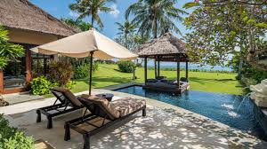
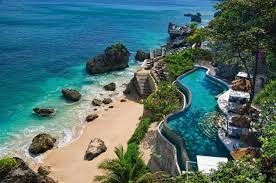
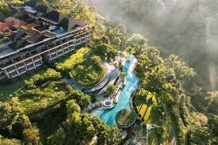
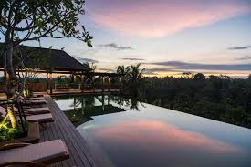
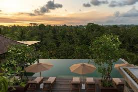

<!DOCTYPE html>
<html>
<head>
    <meta charset="UTF-8">
    <meta name="viewport" content="width=device-width, initial-scale=1.0">
    <title>Indonesian Tourism</title>
    
</head>
<body>
    <header>
        

        
        <h1>Indonesian Tourism</h1>
        <nav>
            <ul>
                <li><a href="#culture">Indonesian cultures</a></li>
                <li><a href="#tourism">Best Tourist Attractions</a></li>
                <li><a href="#hotels">Favorite Hotel List</a></li>
            </ul>
        </nav>
    </header>

    <section id="culture">
        <h2>Indonesian cultures</h2>
        
Indonesia is a country rich in diverse ethnic cultures. Every tribe in Indonesia has unique and interesting dances, ceremonies and traditions. Examples of traditional Indonesian dances include the Pendet Dance, Saman Dance, and Reog Dance. Traditional ceremonies such as the Tedak Siten Ceremony and the Balinese Omed-omedan Tradition are also part of the richness of Indonesian culture.

    </section>

    <section id="tourism">
        <h2>Best Tourist Attractions</h2>
        
Indonesia has many of the best tourist attractions, from beautiful beaches such as Kuta Beach in Bali, to historical sites such as Borobudur Temple in Central Java. Apart from that, Indonesia also has amazing natural destinations such as Komodo National Park and Lake Toba. Each tourist spot offers different uniqueness and beauty.

    </section>

    <section id="hotels">
        <h2>Favorite Hotel List</h2>
        
The following is a list of favorite hotels in Indonesia along with complete facilities, prices, addresses and other important information:

        <ul>
            <li><strong>Ayana Villas Bali</strong> 
                

                    

                        
                        <button class="prev" onclick="plusSlides(-1)">&#10094;</button>
                        <button class="next" onclick="plusSlides(1)">&#10095;</button>
                    

                    

                        
                        <button class="prev" onclick="plusSlides(-1)">&#10094;</button>
                        <button class="next" onclick="plusSlides(1)">&#10095;</button>
                    

                

                Facilities: Swimming pool, restaurant, Poolside bar, fitness center, Dry cleaning service, 24-hour security guard 
                Price: Starting from IDR 18,000,000 per night 
                Address: Jl. Karang Mas Sejahtera, Jimbaran 83634 Indonesia </li>

            <li><strong>Padma Resort Ubud</strong> 
                

                    

                        
                        <button class="prev" onclick="plusSlides(-1)">❮ Prev</button>
                        <button class="next" onclick="plusSlides(1)">Next ❯</button>
                    

                    

                        
                        <button class="prev" onclick="plusSlides(-1)">&#10094;</button>
                        <button class="next" onclick="plusSlides(1)">&#10095;</button>
                    

                

                Facilities: Spa, meeting rooms, 24-hour room service, 24-hour security guard, Bar/lounge 
                Price: Starting from IDR 5,000,000 per night 
                Address: Banjar Carik, Puhu, Payangan 80572 Indonesia </li>

            <li><strong>Adiwana Bisma</strong> 
                

                    

                        
                        <button class="prev" onclick="plusSlides(-1)">❮ Prev</button>
                        <button class="next" onclick="plusSlides(1)">Next ❯</button>
                    

                    

                        
                        <button class="prev" onclick="plusSlides(-1)">&#10094;</button>
                        <button class="next" onclick="plusSlides(1)">Next ❯</button>
                    

                

                Facilities: Business center, airport shuttle, free breakfast, 24-hour security, Bar/lounge 
                Price: Starting from IDR 3,000,000 per night 
                Address: Jl. Bisma, Ubud 80571 Indonesia </li>
        </ul>
    </section>

    
    <form id="transactionForm" class="left-align" onsubmit="processTransaction(event)">
        <!-- Isi form transaksi -->
    </form>
    
    <footer>
        <h3>Transaction</h3>
        
Please fill out the form below to proceed with the transaction:

        <form id="transactionForm" onsubmit="processTransaction(event)">
            <label for="name">Name:</label>
            <input type="text" id="name" name="name" required>  
            
            <label for="email">Email:</label>
            <input type="email" id="email" name="email" required>  
            
            <label for="paymentMethod">Payment Method:</label>
            <select id="paymentMethod" name="paymentMethod" required>
                <option value="creditCard">Credit Card</option>
                <option value="bankTransfer">Bank Transfer</option>
                <option value="eWallet">E-Wallet</option>
            </select>  
            
            <label for="amount">Transaction Amount:</label>
            <input type="number" id="amount" name="amount" required>  
            
            <button type="submit">Make Transaction</button>
        </form>
    </footer>
    
    
    
</body>
</html>
